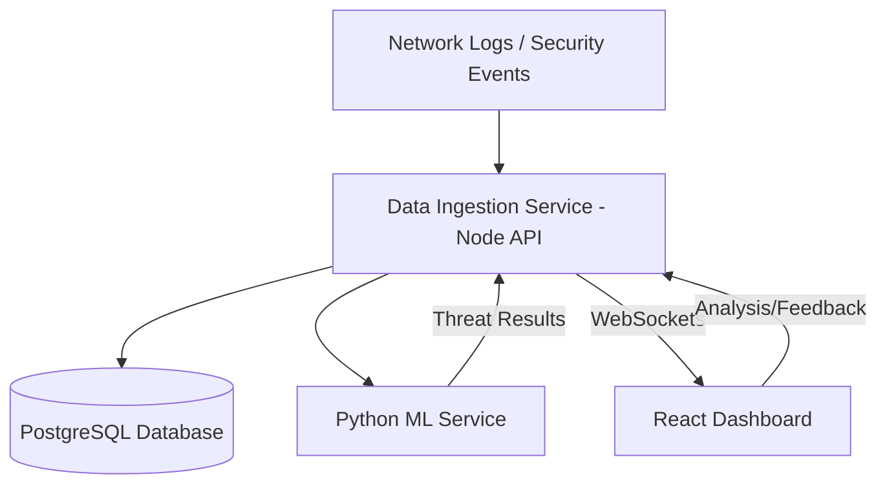
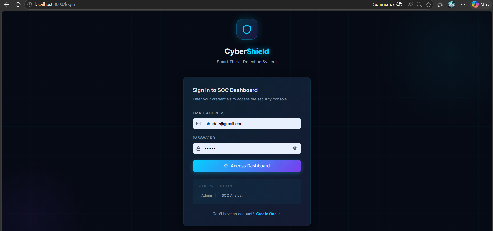
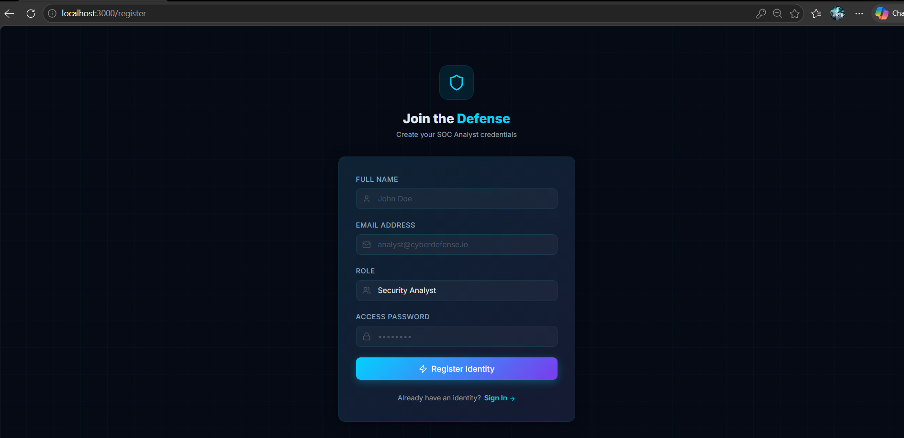
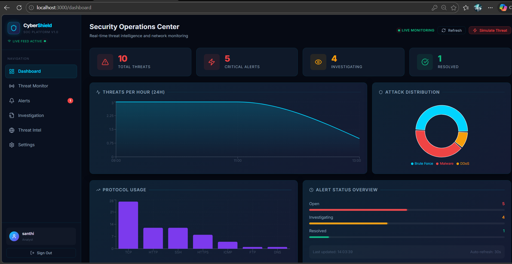
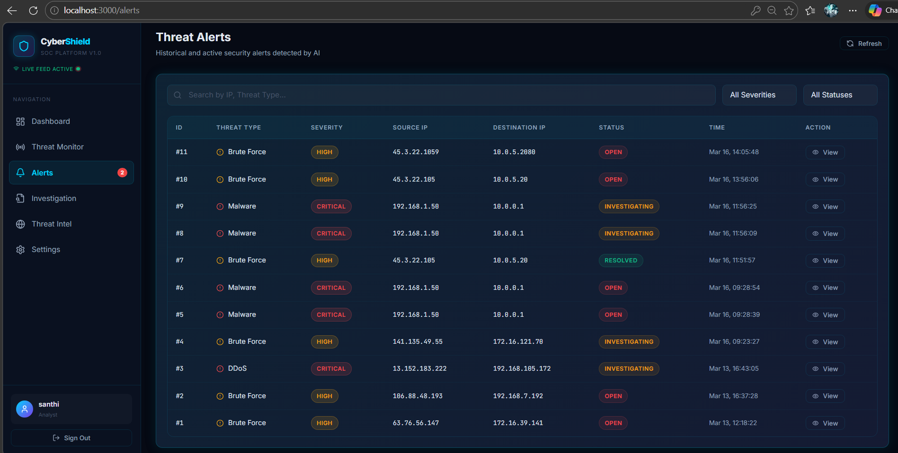
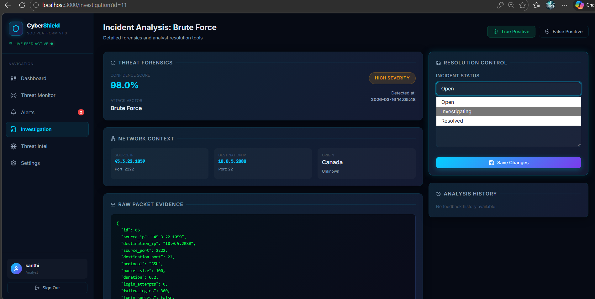
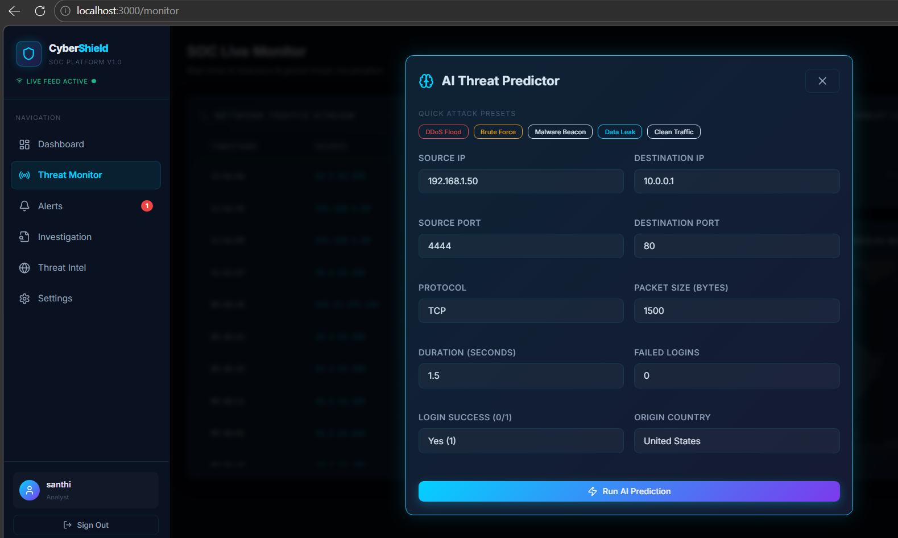

# Smart Cyber Threat Detection System

A high-performance, full-stack cybersecurity application designed for Security Operations Centers (SOC) to detect, classify, and prioritize cyber threats in real-time using Machine Learning.

## 🚀 Overview

The **Smart Cyber Threat Detection System** leverages AI to analyze network traffic patterns and identify malicious activities such as DDoS attacks, Brute Force attempts, Malware C2 traffic, and more. It provides SOC analysts with an interactive, neon-themed dashboard for real-time monitoring and rapid incident investigation.

---

## 🛠 Technology Stack

### Frontend
- **React.js (Vite)**: Modern, reactive UI.
- **TailwindCSS**: Premium styling with cyber aesthetics.
- **Recharts**: High-performance data visualization.
- **Socket.io-client**: Real-time push notifications.
- **Framer Motion**: Smooth micro-animations.

### Backend
- **Node.js & Express**: High-concurrency RESTful API.
- **Socket.io**: Real-time WebSocket event streaming.
- **JWT (JsonWebToken)**: Secure authentication and RBAC.
- **PostgreSQL**: Robust relational data storage for logs and alerts.

### Machine Learning
- **Python (FastAPI)**: High-performance ML serving.
- **Scikit-learn**: Primary model framework (Random Forest, Isolation Forest).
- **Pandas & NumPy**: Data preprocessing and feature engineering.
- **Joblib**: Model serialization.

---

## 🏗 System Architecture



1. **Ingestion**: Node.js API receives network logs.
2. **Analysis**: Data is forwarded to the Python ML Service for real-time prediction.
3. **Storage**: Both logs and detected threats (Alerts) are persisted in PostgreSQL.
4. **Monitoring**: Alerts are pushed instantly to the React UI via WebSockets.
5. **Investigation**: Analysts investigate incidents, provide feedback, and resolve alerts.

---

## ✨ Core Features

- **Real-Time Threat Monitoring**: Live stream of network traffic with visual indicators for anomalies.
- **Interactive SOC Dashboard**: 
  - Threat volume over time (Area Charts).
  - Attack type distribution (Pie Charts).
  - Protocol usage analytics (Bar Charts).
- **AI-Powered Detection Engine**:
  - **Random Forest**: 94%+ accuracy in attack classification.
  - **Isolation Forest**: Unsupervised anomaly detection for novel threats.
- **Incident Forensics**: Detailed investigation page showing raw packet data, confidence scores, and origin metadata.
- **Threat Intelligence**: Built-in global IP blacklist and suspicious domain tracking.
- **Feedback Loop**: Analysts can mark alerts as True/False Positives, providing data for future model retraining.

---
## 📸 Application Screenshots

### 🔐 Login Page
User authentication with secure JWT-based login system.  


---

### 📝 Register Page
New users can securely register with role-based access.  


---

### 📊 Dashboard
Real-time SOC dashboard showing threat analytics, attack trends, and protocol usage.  


---

### 🚨 Alerts Page
Displays detected threats with severity levels (High, Medium, Low) and detailed metadata.  


---

### 🔍 Investigation Page
Detailed forensic analysis of selected alerts including packet data and prediction confidence.  


---

### 🖥️ Threat Monitor Page
Live monitoring of incoming network traffic and real-time threat detection results from the ML engine.  


## 📈 Results

- Achieved **94%+ accuracy** using Random Forest.
- Successfully detected multiple attack types including DDoS and brute force.
- Reduced false positives compared to traditional rule-based systems.
- Real-time alert generation under **100ms latency**.

## 📦 Project Structure

```text
cyber-threat-detection-system/
├── backend/node-api/          # Node.js Express Server
├── frontend/react-dashboard/  # Vite React App
├── ml-service/python-model/   # FastAPI ML Service & Training scripts
├── database/                  # SQL Schema scripts
└── dataset/                   # Synthetic security logs (10k records)
```

---

## ⚙️ Installation & Setup

### Prerequisites
- Node.js (v18+)
- Python (3.9+)
- PostgreSQL (v14+)

### 1. Database Configuration
Create a database named `cyber_threat_db` in PostgreSQL and run:
```bash
psql -U postgres -d cyber_threat_db -f database/schema.sql
```

### 2. Machine Learning Service
```bash
cd ml-service/python-model
pip install -r requirements.txt
python app.py
```
*Port: 5001*

### 3. Backend API
```bash
cd backend/node-api
npm install
npm start
```
*Port: 5000*

### 4. Frontend Dashboard
```bash
cd frontend/react-dashboard
npm install
npm run dev
```
*Port: 3000*

---

## 🔒 Security & Performance
- **JWT Authentication**: Secure stateless access control.
- **Rate Limiting**: Protection against API abuse.
- **Input Validation**: Sanitization for SQL Injection and XSS prevention.
- **High Performance**: ML detection responses under 100ms; Dashboard updates under 500ms.

---

## 🔮 Future Enhancements
- Integration with live SIEM tools (Elasticsearch/Splunk).
- Deep Learning (LSTM) for sequence-based attack detection.
- Automated incident response (Safe-blocking of malicious IPs).
- AI SOC Chatbot for natural language query of security logs.

---
© 2026 Smart Cyber Threat Detection System. Designed for the next generation of cybersecurity.
